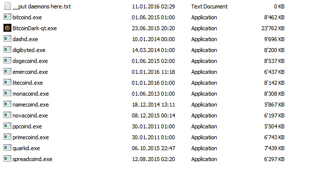
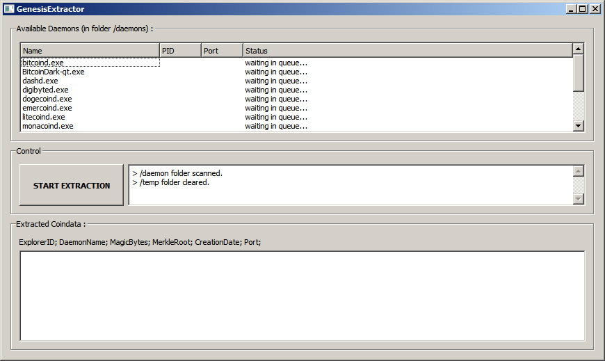
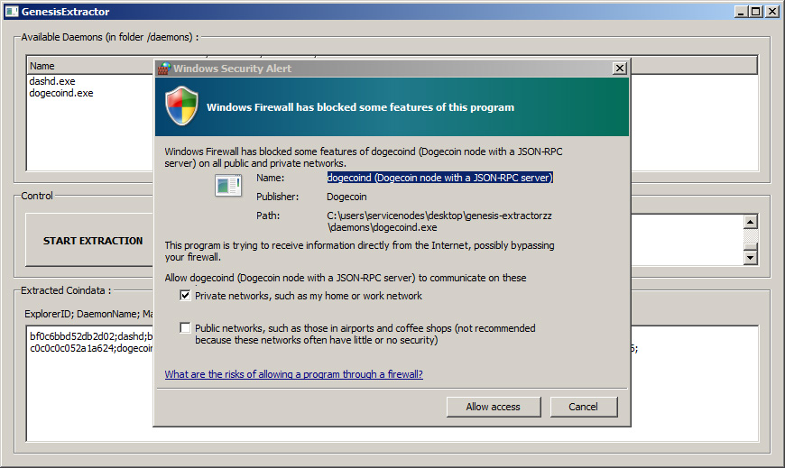
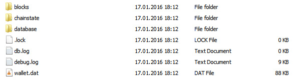
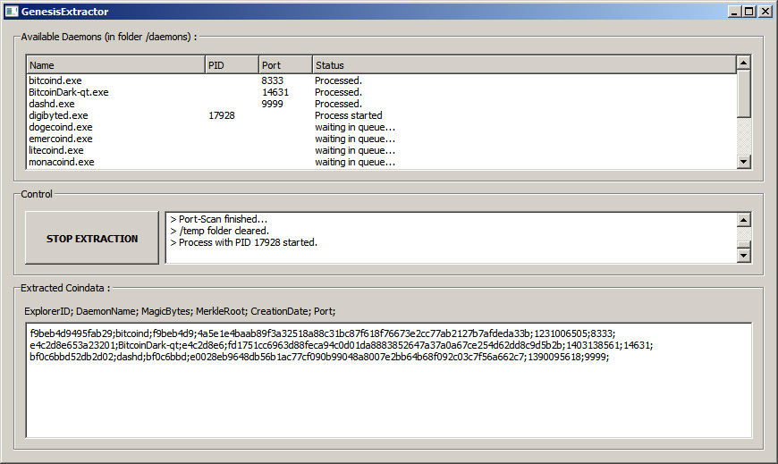
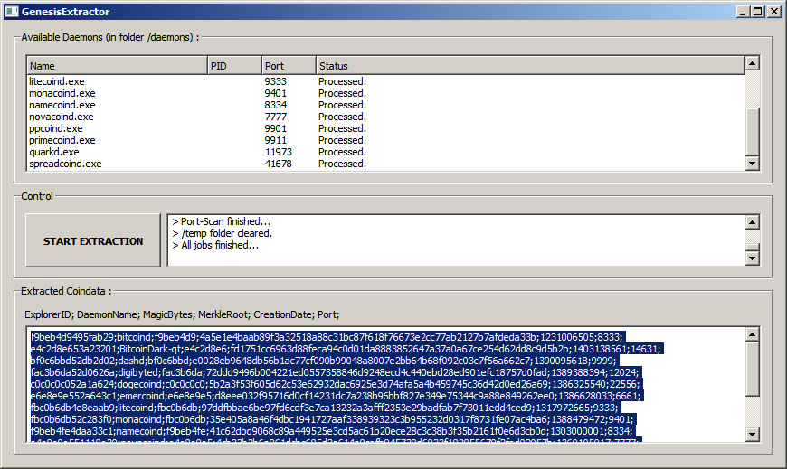

# genesisextractor
Tool that automatically extracts official P2P port and genesisblock data out of daemons. 
This is part of <a href="http://www.spreadcoin.info" target="_blank"><b>Spreadcoin's</b></a> <b>"Altcoin Taxonomy Initiative"</b>. 
Read more about it here: <a href="http://spreadcointalk.org/index.php?topic=730.0" target="_blank">http://spreadcointalk.org/index.php?topic=730.0</a>

<h1><u><b>Download:</b></u></h1>

Win (32bit): http://www.spreadcoin.info/downloads/genesis-extractor.zip

<h1><u><b>Quick Guide:</b></u></h1>

Unpack the zip-file somewhere. Click on GenesisExtractor.exe to start the tool.

For the tool to be able to process daemons, it requires that you put atleast one altcoin-daemon in the /daemons folder.

You can add any daemon you like, and if you can't find a daemon for the coin of your choice you can try with the qt-wallet.exe. 
(Note: some coins come with a few external dll's they make use of. They simply won't work correctly without those external dll's).

Once there are daemons to process, they will appear in the "Available Daemons" list.  
(You might need to restart the tool to rescan for daemons you just added).  
You can now click "START EXTRACTION" to start the tool.

Please note that during the extraction operation you might see external windows appear and disappear.
<b>Don't interfere with this process.<b> Any process/window that is opened will also be closed automatically later.  

And it's possible that your firewall will ask you if you want to open the port that the coin is accessing.

<b>You don't need to open any port, since the extraction-tool will recognize what port the coin is trying to use, even when said port is closed.<b>  

